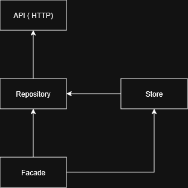
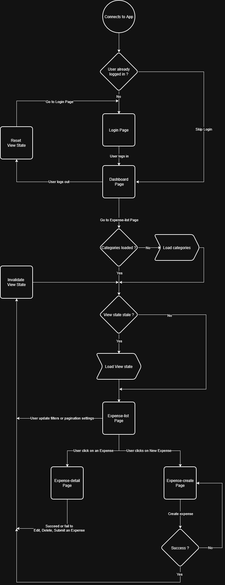

# DOCUMENTATION

## How to

### Serve

Run `npx nx run n2f:serve`

### Test

Run `npx nx run n2f:test`


## Features

### Architecture

The application is a SPA organized using DDD principles.

```
app/                        
    core/                        # auth, global config, interceptors, logging
    features/
      feature/
        data-access/             # API clients, DTOs, error mapping
        domain/                  # models, repository, facade, stores
        shared/                  # feature-scoped ui components, utils, pipes, validators...   
        **/                      # feature-scoped sub-features
      shared/
```

This architecture allows for clean boundaries and makes it easy to extend, and possibly to transition to a MFE architecture.
In fact as a MFE the app could have the following structure :

```
apps/
  shell/                        # maps to "/dashboard" in the current architecture
  mfe-login/
  mfe-expense/
packages/
  core/
  ui/
  util/
  user/
```

One advantage is that each app would only import packages they are authorized to as per their manifests.

#### Services & stores

The app showcases four main kind of services:
- API (or http) services, which reflect the backend API
- Repository services which map DTO models to Domain models
- Stores which hold state relevant for different use cases of the feature
- Facade services, which expose functionalities to the other feature consumers (components and resolvers mainly)

Below is the dependency graph between these services:



Facade, API(http), and repository services are designed stateless, or relay state that they do not own themselves.

State is managed by stores.

Stores are scoped to their module (feature) to enforce domain boundaries. Yet, because the stores still live when their injector is destroyed (such as when navigating out of the module),
the data still lives and will be reused later should the user navigates back to that module. This is the case for Category data.

On logout, Stores that are scoped to a session are invalidated to avoid stale data (e.g. the user accessing expenses from the previous user).

### Auth

This application does not have authentication per se, but it scopes navigation to the currently active User. 
Activating a user is done in the "login screen", by picking one of the users provided by the backend.

Current user is stored in local storage until logout, to allow for a more seamless experience, and to showcase route guards.

### UI/UX

The UI reflects the business context and the backend capabilities.

For example, an app shell has been implemented to enable integrating other modules in the future.

Additionally, since the backend returns paginated and filterable content, the UI showcase filters and a paginator.

The interface is also responsive and accessible:
- the layout uses flex contents that shrink and grow as needed
- interactable components are clearly recognizable via their hover/focus behavior
- keyboard navigation is supported
- the side menu collapses automatically under certain viewport dimensions
- consistent UI rules: theme, primary & secondary components
- notifications following any form submissions and errors
- loading state being tracked and displayed properly

### Data flow

Business rules indicate that the user owns the mutation of the data. As a result, eagerly fetching data on page load is 
not always necessary to display a consistent UI, and the app can dictate when to refresh its data based on the user actions.

Managing data involve managing domain data (Category, Expense, User), and data related to the view's state.

Two core decisions have been made on this topic:

#### Storing Categories

Category data is needed across the whole Expense feature:
- in the dashboard listing all expenses, as a filter parameter, and to be displayed along an expense;
- in the detailed view of an expense;
- in the creation/update form.

It is safe to assume categories are not volatile data;
- current backend only supports read operations on Category;
- Category is effectively admin data; end users do not mutate them.

As a result, Categories are loaded only once during the app lifecycle and stored for subsequent uses.

#### Storing the View's state

The ExpenseListViewStore only purpose is to allow the state of the ExpenseList page's view to survive navigation.

For example, it allows the user to view an expense's details, or navigate to another module, then navigate back to the
expenses dashboard and view it as it was when he left the page, and without fetching data. 

### User flow

The flow chart below describes a typical user experience.



#### Login

When the user logs in, its identity is stored in the local storage so that subsequent loading of the application allow accessing the inner modules directly

#### Expense-forms

When an expense is mutated (either by creation, edition, deletion or status update), it can either succeed or fail.

If it succeeds, the system:
- Notifies the user about success;
- Invalidates the ExpenseListViewStore;
- Navigates to Expense-list.

If it fails, the system:
- Notifies the user about the error;
- Navigates to Expense-list, except for creation to give the user a chance to correct the form data.

#### Logout

On logout, all session scoped data are flushed (Identity, Expense-list page state), and the user is redirected to the login screen.

### Testing

Even though TDD was the initial approach and produced overall ~30 relevant tests, it became clear fast that a full test coverage would not be possible within the allocated time frame;

### Improvements

The improvements I consider:
- the project could leverage OpenAPI to generate client and models from the backend, or from a RAML. It would reduce boilerplate code, while ensuring both backend and frontend APIs are synchronized;
- enforce domain boundaries by migrating to a MFE architecture;
- increase testing coverage (components in particular).
- preparing and implementing translation: UI strings could be replaced with Maps keys, and translated dynamically using the lib ngx-translate for instance;
- using OnPush strategy: while the Signal API makes it less relevant, it can still help to improve performance for large scale application
- extract common logic from create and edit form components, as some logic is almost duplicated;
- more consistent style rules: spacing in particular
- add an http cache
- add a canDeactivate guard on creation form
