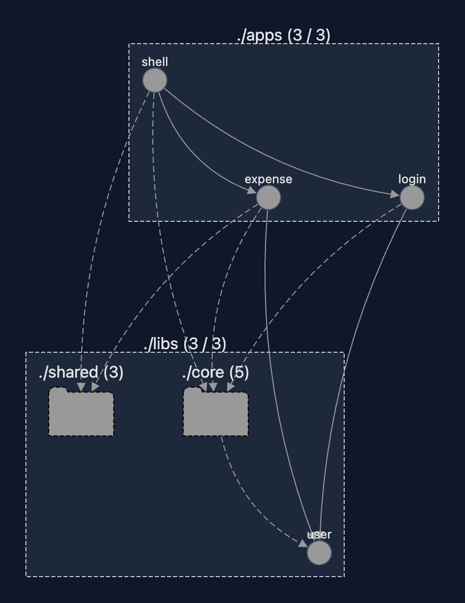
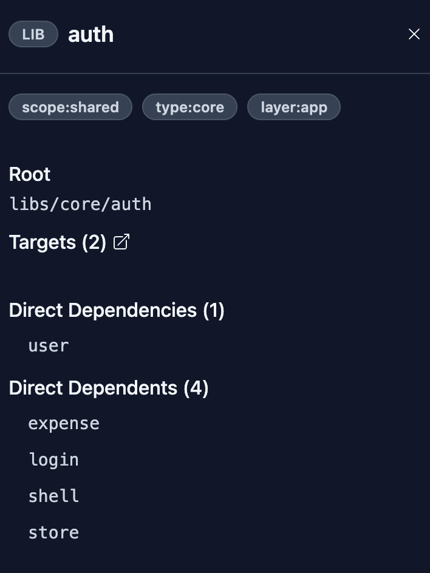

# Mfe

This sub-project is a refactorisation of the frontend project structured as a MicroFrontend.

## Graph

The project comprises a shell app which hosts two remotes: login and expense.

It is also made up of several libs:
- "core" libs hold code related to global application logic: singletons, http logic, authentication;
- "shared" libs may see use by multiple remotes: ui components, utils;
- "feature" libs each holds code related to a domain of the app: user is the only explicit lib, but expense would be a could candidate.

### Example: Auth lib

### About remotes

There are several motivations behind a remote:
- the module is worked on by a different, dedicated team;
- the module has clear boundaries as per business rules;
- the module needs or could benefit from independent deployment;
- security & performance via lazy-loading (but already possible without MFE).

#### Login

Organizations that manage many projects typically handle authentication separately by funneling it through the interface of an IDP for instance.

In this situation, many projects depend on a common remote login solution.

#### Expense

Expense is a great candidate for a remote considering it is a standalone feature module.

## Boundaries

Boundaries are enforced as linter rules in eslint.config.mjs.

We want to enforce the following rules:
- Remotes are isolated from each other;
- Host can orchestrate remotes;
- Feature modules with clear business scope (e.g. expense) must not depend on similar other feature modules;
- Vertical architecture: domain may only depend on data-access and be depended on by features;
- Shared is reusable by anyone.

### Scopes

The Scope is a first filter that prevent libs from being used by any remotes. 

Possible values: host, remote, shared, host-only, expense

### Types

The Type helps to enforce layer rules, preventing for example a lib owning a remote's feature to directly depend on a data-access library.

Possible values: app, feature, data-access, domain, ui, utils

### Role

The Role is used by apps to indicate whether they are remotes or the shell. 

Possible values: host, remote

## Evolutions

Expense remote could be divided in many libs, to make use of vertical layer rules. For example:
- feature-expense-list
- feature-expense-create
- feature-expense-edit
- ...
- feature-expense-data-access
- feature-expense-domain

Notably this architecture would prevent expense-data-access to be depended on by any other lib than feature-expense-domain

Also, categories and user could be moved to a "feature" lib folder.
